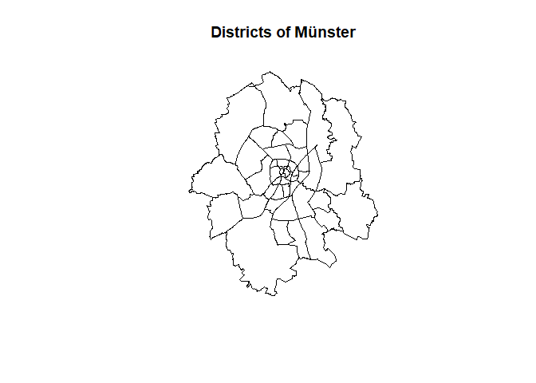
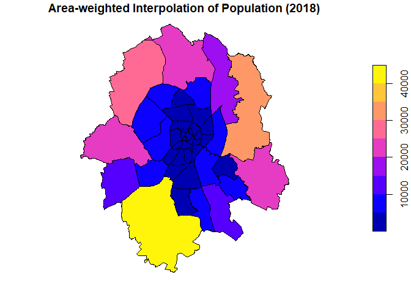

# dasymetric

<!-- badges: start  -->
<!-- badges: end -->

The goal of [dasymetric
mapping](https://en.wikipedia.org/wiki/Dasymetric_map) is to display
statistical data (like census data) in meaningful spatial zones.

## Installation

And the development version from [GitHub](https://github.com/) with:

``` r
# install.packages("devtools")
devtools::install_github("JaFro96/dasymetric")
```

## Example

As a case study we try to predict population counts for each districts
of Münster with land cover data as ancillary information.

    #> Lade nötiges Paket: sf
    #> Linking to GEOS 3.9.0, GDAL 3.2.1, PROJ 7.2.1



That’s how the population is distributed using area-weighted
interpolation:

    #> Lade nötiges Paket: areal



    #> Lade nötiges Paket: dasymetric
    #> Warning: attribute variables are assumed to be spatially constant throughout all
    #> geometries

    #> Warning: attribute variables are assumed to be spatially constant throughout all
    #> geometries


## Data Sources

-   CORINE Land Cover 5 ha –&gt; [© GeoBasis-DE /
    BKG (2021)](https://gdz.bkg.bund.de/index.php/default/catalog/product/view/id/1071/s/corine-land-cover-5-ha-stand-2018-clc5-2018/category/8/?___store=default)

-   district boundaries –&gt;
    [opendata.stadt-muenster.de](https://opendata.stadt-muenster.de/dataset/geokoordinaten-der-stadtteil-grenzen-geometriedaten-der-kleinr%C3%A4umigen-gebietsgliederung)

-   population counts –&gt;
    [opendata.stadt-muenster.de](opendata.stadt-muenster.de)
