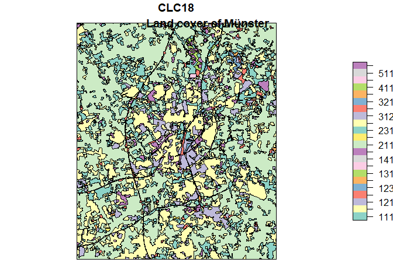

# dasymetric

<!-- badges: start -->
<!-- badges: end -->

The goal of dasymetric is to display statistical data in meaningful
spatial zones

## Installation

You can install the released version of dasymetric from
[CRAN](https://CRAN.R-project.org) with:

``` r
install.packages("dasymetric")
```

And the development version from [GitHub](https://github.com/) with:

``` r
# install.packages("devtools")
devtools::install_github("JaFro96/dasymetric")
```

## Example

As a case study the districts of Münster were chosen and we try to
predict the population counts on the basis of land cover data.




You’ll still need to render `README.Rmd` regularly, to keep `README.md`
up-to-date. `devtools::build_readme()` is handy for this. You could also
use GitHub Actions to re-render `README.Rmd` every time you push. An
example workflow can be found here:
<https://github.com/r-lib/actions/tree/master/examples>.
