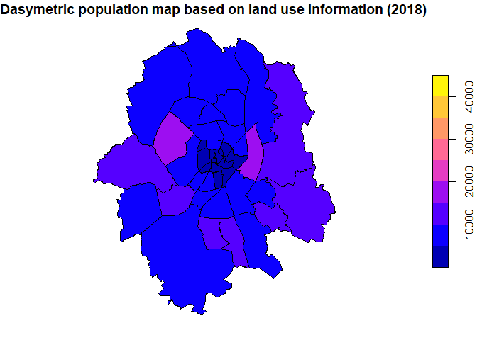

# dasymetric

<!-- badges: start -->
<!-- badges: end -->

The goal of [dasymetric
mapping](https://en.wikipedia.org/wiki/Dasymetric_map) is to display
statistical data (like census data) in meaningful spatial zones.

## Installation

And the development version from [GitHub](https://github.com/) with:

``` r
# install.packages("devtools")
devtools::install_github("JaFro96/dasymetric")
```

## Example

As a case study we try to predict population counts for each district of
Münster (Westfalen) using land cover data as ancillary information.

``` r
# plot population of 2018
require(sf)
load("data/population_counts.rda")
plot(population_counts["population"],breaks = c(0,5000,10000,15000,20000,25000,30000,35000,40000,45000), main="Population (2018)")
```


Below the dasymetric map is plotted which exhibits similar patterns in
the population distribution

``` r
require(dasymetric)
load("data/corine_18.rda")
urban = prep_landuse(corine_18)

# source geometry covering entire Münster 
source_geom = st_union(population_counts)
# add population of Münster
source = st_sf(ID = 1, pop_sum = sum(population_counts["population"]$population), source_geom)

# dasymetric map with landuse information as ancillary data
dm_pop = dasymetric_map(population_counts, source, urban, extensive = "pop_sum")
plot(dm_pop["pop_sum"],breaks = c(0,5000,10000,15000,20000,25000,30000,35000,40000,45000),main="Dasymetric Population Map based on Land Use Information (2018)")
```



… contrary to the population distribution using area-weighted
interpolation:

``` r
require(areal)
# Area-weighted interpolation of Münsters districts
aw_pop = aw_interpolate(population_counts,NR_STATIST,source = source, sid = ID,weight = "sum", extensive = "pop_sum", output = "sf")
plot(aw_pop["pop_sum"],breaks = c(0,5000,10000,15000,20000,25000,30000,35000,40000,45000),main="Area-weighted Interpolation of Population (2018)")
```


## Data Sources

-   CORINE Land Cover 5 ha –&gt; [© GeoBasis-DE /
    BKG (2021)](https://gdz.bkg.bund.de/index.php/default/catalog/product/view/id/1071/s/corine-land-cover-5-ha-stand-2018-clc5-2018/category/8/?___store=default)

-   district boundaries –&gt;
    [opendata.stadt-muenster.de](https://opendata.stadt-muenster.de/dataset/geokoordinaten-der-stadtteil-grenzen-geometriedaten-der-kleinr%C3%A4umigen-gebietsgliederung)

-   population counts –&gt;
    [opendata.stadt-muenster.de](opendata.stadt-muenster.de)
