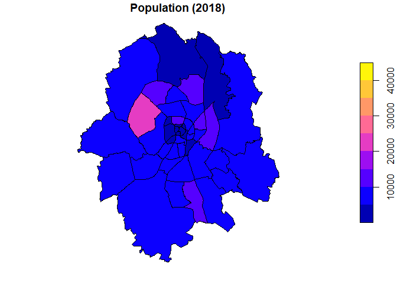
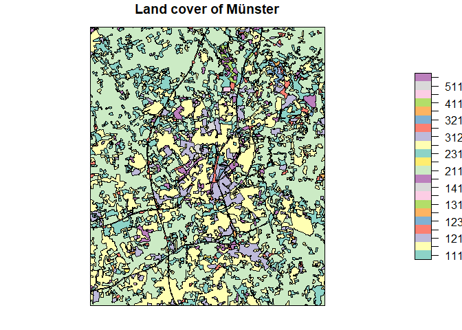

# dasymetric

<!-- badges: start -->
<!-- badges: end -->

The goal of [dasymetric mapping](https://en.wikipedia.org/wiki/Dasymetric_map) is to display statistical data (like census data) in meaningful spatial zones. 

## Installation

You can install the development version from [GitHub](https://github.com/) with:

``` r
# install.packages("devtools")
devtools::install_github("JaFro96/dasymetric")
```

## Example

As a case study we try to predict population counts for each districts of Münster with land cover data as ancillary information.





## Data Sources
- CORINE Land Cover 5 ha --> [© GeoBasis-DE / BKG (2021)](https://gdz.bkg.bund.de/index.php/default/catalog/product/view/id/1071/s/corine-land-cover-5-ha-stand-2018-clc5-2018/category/8/?___store=default)

- district boundaries --> [opendata.stadt-muenster.de](https://opendata.stadt-muenster.de/dataset/geokoordinaten-der-stadtteil-grenzen-geometriedaten-der-kleinr%C3%A4umigen-gebietsgliederung)

- population counts --> [opendata.stadt-muenster.de](opendata.stadt-muenster.de)
